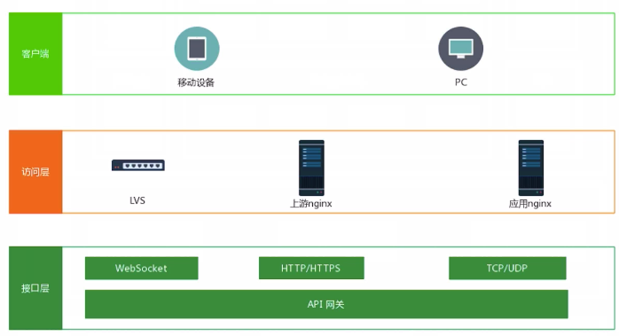
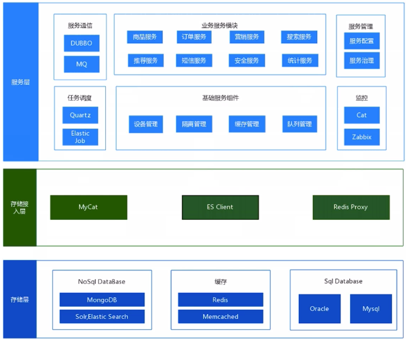
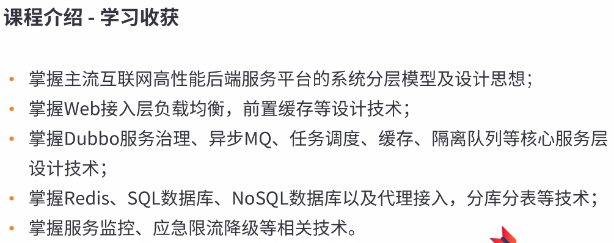

## 职责
- 明确需求
- 系统分析
- 技术选型
- 制定架构, 执行

## Career path
- coding
- framework
- 技术攻关, 性能优化
- 解决业务, 技术问题

## 能力
- 设计能力
- 管理能力
- 沟通能力
- 技术实力
- 应急能力
- 抽象能力

## 课程要点
1. 架构设计分层实现
2. 访问层架构知识
3. API 网关层架构知识
4. 核心服务层架构知识
5. 数据存储及接入层架构知识
6. 监控, 限流, 降级知识

## 目标

